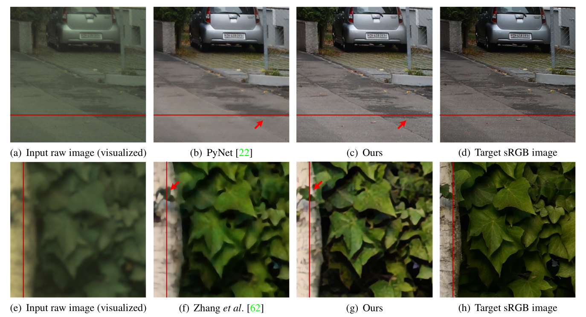

# Learning RAW-to-sRGB Mappings with Inaccurately Aligned Supervision (ICCV 2021)

PyTorch implementation of [Learning RAW-to-sRGB Mappings with Inaccurately Aligned Supervision](http://arxiv.org/abs/2108.08119)

## 1. Framework

<p align="center"></p>
<p align="center">Figure 1: Illustration of the proposed joint learning framework.</p>

## 2. Results

<p align="center"></p>
<p align="center">Figure 2: Example of data pairs of ZRR and SR-RAW datasets, where clear spatial misalignment can be observed with the reference line. With such inaccurately aligned training data, PyNet [22] and Zhang et al. [62] are prone to generating blurry results with spatial misalignment, while our results are well aligned with the input.</p>

## 3. Preparation

- **3.1 Prerequisites**
    - PyTorch (v1.6)
    - Python 3.x, with OpenCV, Numpy, CuPy, Pillow and tqdm, and tensorboardX is used for visualization

- **3.2 Dataset**
        - [Zurich RAW to RGB dataset](https://docs.google.com/forms/d/e/1FAIpQLSdH6Pqdlu0pk2vGZlazqoRYwWsxN3nsLFwYY6Zc5-RUjw3SdQ/viewform) and [SR-RAW Dataset](https://drive.google.com/drive/folders/1UHKEUp77tiCZ9y05JtP6S9Tfo2RftK8m) are used for experiments.
       
## 4. Quick Start

We show some exemplar commands here for better introduction.
<!-- and more useful scripts are given in the [scripts](./scripts) folder. -->

### 4.1 Training

- Zurich RAW to RGB dataset 

    ```console
    python train.py \
    --dataset_name eth    --model zrrjoint    --name $name          --gcm_coord True  \
    --ispnet_coord True   --niter 80          --lr_decay_iters 40   --save_imgs False \
    --batch_size 16       --print_freq 300    --calc_psnr True      --lr 1e-4   -j 8  \
    --dataroot /data/dataset/Zurich-RAW-to-DSLR 
    ```

- SR-RAW Dataset
    
    To be continued...

### 4.2 Testing

- The pre-trained models will be released soon.

- Zurich RAW to RGB dataset

    ```console
    python test.py \
    --model zrrjoint    --name zrrjoint    --dataset_name eth   --ispnet_coord True  --alignnet_coord True \
    --load_iter 80      --save_imgs True  --calc_psnr True      --gpu_id 0           --visual_full_imgs False \
    --dataroot /data/dataset/Zurich-RAW-to-DSLR
    ```

- SR-RAW Dataset
    
    To be continued...

### 4.3 Note

- You can specify which GPU to use by `--gpu_ids`, e.g., `--gpu_ids 0,1`, `--gpu_ids 3`, `--gpu_ids -1` (for CPU mode). In the default setting, all GPUs are used.
- You can refer to [options](./options/base_options.py) for more arguments.

## 5. Citation
If you find it useful in your research, please consider citing:

    @inproceedings{RAW-to-sRGB,
        title={Learning RAW-to-sRGB Mappings with Inaccurately Aligned Supervision},
        author={Zhang, Zhilu and Wang, Haolin and Liu, Ming and Wang, Ruohao and Zuo, Wangmeng and Zhang, Jiawei},
        booktitle={ICCV},
        year={2021}
    }

## 6. Acknowledgement

This repo is built upon the framework of [CycleGAN](https://github.com/junyanz/pytorch-CycleGAN-and-pix2pix), and we borrow some code from [PyNet](https://github.com/aiff22/PyNET-PyTorch), [Zoom-Learn-Zoom](https://github.com/ceciliavision/zoom-learn-zoom), [PWC-Net](https://github.com/sniklaus/pytorch-pwc) and [AdaDSR](https://github.com/csmliu/AdaDSR), thanks for their excellent work!
